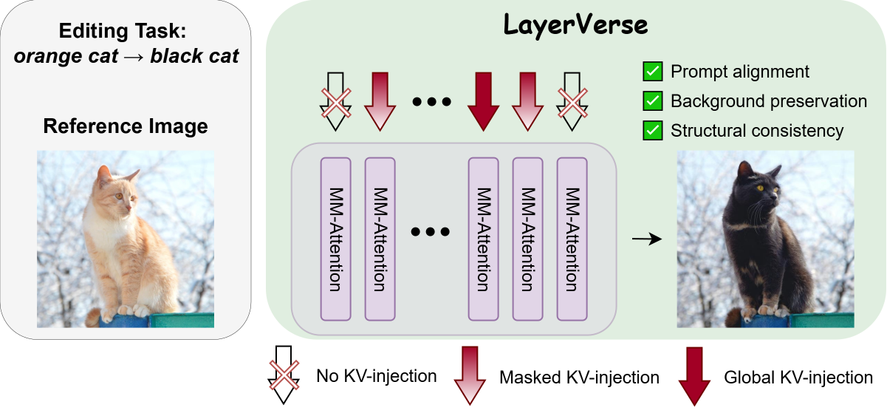
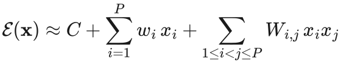
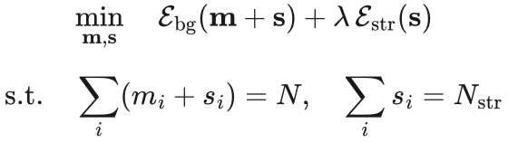
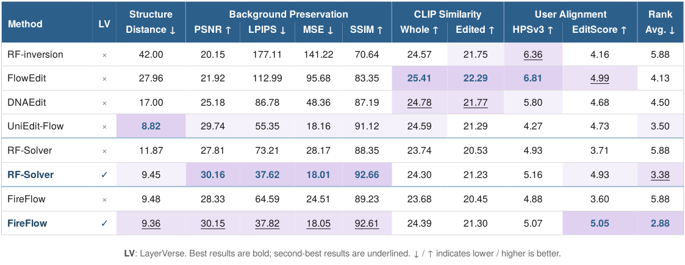
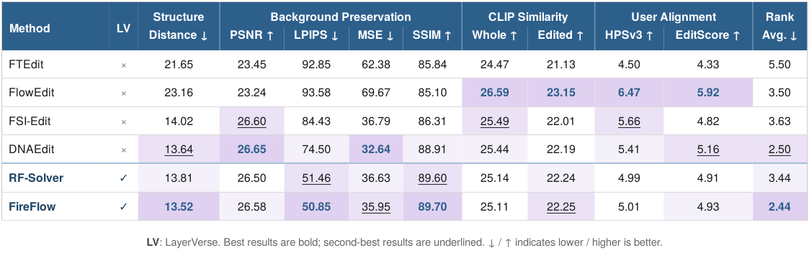

# [ECCV 2026] LayerVerse: Finding the Sweet Spot for KV-Injection in Training-Free Image Editing

[](https://v-gen-ai.github.io/LayerVerse/)
[](https://media.eventhosts.cc/Conferences/ECCV2026/pdfs/6255.pdf)

---

<p align="center"></p>

> 💡 **TL;DR.** *LayerVerse* improves training-free image editing by choosing which transformer blocks reuse source key–value features and where those features are injected. Masked injection preserves the background; a few global injections preserve the edited object's structure. The block allocation is calibrated once per backbone and reused across editing solvers.

## Overview

Image editing should follow the target prompt while preserving the parts of the source image that should stay unchanged. Inversion-based editors reuse source attention keys and values (KV) to preserve the image, but fixed injection heuristics are too rigid: global injection can suppress the requested edit, while masked-only injection protects the background but often loses the structure of the edited object.

*LayerVerse* assigns transformer blocks to two complementary roles:

- **Masked KV-injection** reuses source features outside the editing region and preserves the background.
- **Global KV-injection** reuses source features across the whole image in a small number of blocks and anchors the object's structure.

The remaining blocks stay inactive. *LayerVerse* selects the roles jointly: the main paper uses the bottom-up **Model A** to model individual block effects and pairwise interactions, then solves a mixed-integer linear program (MILP) under fixed block budgets. The allocation is calibrated once per backbone with an Euler solver and then reused with FireFlow and RF-Solver, without retraining the backbone or recalibrating for each solver.

At inference time, *LayerVerse* obtains the editing mask from cross-attention, so no external segmentation model or user-provided mask is needed.

✅ **The repository includes ready-to-use allocations for FLUX.1-[dev] and SD3.5-medium. You do not need to run calibration to use them.**

<details>
<summary>Block-selection objective</summary>

For a binary vector $\mathbf{x}$ indicating which blocks receive KV-injection, *LayerVerse* uses the main paper's bottom-up **Model A** to approximate an editing metric with a quadratic surrogate:

<p align="center">
  
</p>

Here, $w_i$ is the effect of a single block, and $W_{ij}$ describes how two blocks interact. Model A estimates these coefficients from no-injection, single-block, and block-pair measurements for two objectives: background preservation and object structure.

Each block can receive masked injection ($m_i = 1$), global injection ($s_i = 1$), or neither, with $m_i + s_i \leq 1$. The solver selects exactly $N$ active blocks, including $N_{str}$ global anchors:

<p align="center">
  
</p>

MILP optimizes this calibrated surrogate, rather than evaluating every possible edit. The [calibration README](calibration_with_MILP/README.md) describes the required measurement tables and the solver settings used in this release.

</details>

## 🏆 Results

Examples and quantitative results on PIE-Bench are shown below. See the [project page](https://v-gen-ai.github.io/LayerVerse/) for more comparisons.

### 🎨 FLUX.1-[dev]

<table>
<tr>
  <td width="22%" align="center"><b>Edit</b></td>
  <td width="26%" align="center"><b>Source</b></td>
  <td width="26%" align="center"><b>FireFlow</b></td>
  <td width="26%" align="center"><b>FireFlow + <i>LayerVerse</i></b></td>
</tr>
<tr>
  <td>a colorful <s>car</s> <b>motorcycle</b> is parked on the street</td>
  <td></td>
  <td></td>
  <td></td>
</tr>
<tr>
  <td>a woman wearing a hat and gloves is walking on a <s>snow</s> <b>leaves</b> covered path</td>
  <td></td>
  <td></td>
  <td></td>
</tr>
<tr>
  <td>a <b>fabric</b> ladybug with black spots on its back is sitting on a leaf</td>
  <td></td>
  <td></td>
  <td></td>
</tr>
<tr>
  <td><s>rainbow over</s> the ocean</td>
  <td></td>
  <td></td>
  <td></td>
</tr>
</table>

### 🎨 SD3.5-medium

The paper does not evaluate unmodified FireFlow on this backbone. The comparison below therefore uses DNAEdit alongside FireFlow + *LayerVerse*.

<table>
<tr>
  <td width="22%" align="center"><b>Edit</b></td>
  <td width="26%" align="center"><b>Source</b></td>
  <td width="26%" align="center"><b>DNAEdit</b></td>
  <td width="26%" align="center"><b>FireFlow + <i>LayerVerse</i></b></td>
</tr>
<tr>
  <td>a logo of <s>bird</s> <b>X</b> shape in a black background</td>
  <td></td>
  <td></td>
  <td></td>
</tr>
<tr>
  <td>a <s>young</s> <b>old</b> woman is holding a dog</td>
  <td></td>
  <td></td>
  <td></td>
</tr>
<tr>
  <td><b>a cat and</b> a white vase with purple tulips on a pink background</td>
  <td></td>
  <td></td>
  <td></td>
</tr>
<tr>
  <td>a chair in front of <s>mountains</s> <b>sea</b></td>
  <td></td>
  <td></td>
  <td></td>
</tr>
</table>

The tables reproduce the paper's results on PIE-Bench without style transfer (620 images). **LV** means *LayerVerse*; the best value in each column is bold.

### 📊 FLUX.1-[dev]

<p align="center">
  
</p>

<details>
<summary>Numerical values</summary>

| Method | Structure&nbsp;↓ | PSNR&nbsp;↑ | LPIPS&nbsp;↓ | MSE&nbsp;↓ | SSIM&nbsp;↑ | CLIP whole&nbsp;↑ | CLIP edited&nbsp;↑ | HPSv3&nbsp;↑ | EditScore&nbsp;↑ | Avg. rank&nbsp;↓ |
| --- | --: | --: | --: | --: | --: | --: | --: | --: | --: | --: |
| RF-inversion | 42.00 | 20.15 | 177.11 | 141.22 | 70.64 | 24.57 | 21.75 | 6.36 | 4.16 | 5.88 |
| FlowEdit | 27.96 | 21.92 | 112.99 | 95.68 | 83.35 | **25.41** | **22.29** | **6.81** | 4.99 | 4.13 |
| DNAEdit | 17.00 | 25.18 | 86.78 | 48.36 | 87.19 | 24.78 | 21.77 | 5.80 | 4.68 | 4.50 |
| UniEdit-Flow | **8.82** | 29.74 | 55.35 | 18.16 | 91.12 | 24.59 | 21.29 | 4.27 | 4.73 | 3.50 |
| RF-Solver | 11.87 | 27.81 | 73.21 | 28.17 | 88.35 | 23.74 | 20.53 | 4.93 | 3.71 | 5.88 |
| RF-Solver + LV | 9.45 | **30.16** | **37.62** | **18.01** | **92.66** | 24.30 | 21.23 | 5.16 | 4.93 | 3.38 |
| FireFlow | 9.48 | 28.33 | 64.59 | 24.51 | 89.23 | 23.68 | 20.45 | 4.88 | 3.60 | 5.88 |
| FireFlow + LV | 9.36 | 30.15 | 37.82 | 18.05 | 92.61 | 24.39 | 21.30 | 5.07 | **5.05** | **2.88** |

</details>

### 📊 SD3.5-medium

<p align="center">
  
</p>

<details>
<summary>Numerical values</summary>

| Method | Structure&nbsp;↓ | PSNR&nbsp;↑ | LPIPS&nbsp;↓ | MSE&nbsp;↓ | SSIM&nbsp;↑ | CLIP whole&nbsp;↑ | CLIP edited&nbsp;↑ | HPSv3&nbsp;↑ | EditScore&nbsp;↑ | Avg. rank&nbsp;↓ |
| --- | --: | --: | --: | --: | --: | --: | --: | --: | --: | --: |
| FTEdit | 21.65 | 23.45 | 92.85 | 62.38 | 85.84 | 24.47 | 21.13 | 4.50 | 4.33 | 5.50 |
| FlowEdit | 23.16 | 23.24 | 93.58 | 69.67 | 85.10 | **26.59** | **23.15** | **6.47** | **5.92** | 3.50 |
| FSI-Edit | 14.02 | 26.60 | 84.43 | 36.79 | 86.31 | 25.49 | 22.01 | 5.66 | 4.82 | 3.63 |
| DNAEdit | 13.64 | **26.65** | 74.50 | **32.64** | 88.91 | 25.44 | 22.19 | 5.41 | 5.16 | 2.50 |
| RF-Solver + LV | 13.81 | 26.50 | 51.46 | 36.63 | 89.60 | 25.14 | 22.24 | 4.99 | 4.91 | 3.44 |
| FireFlow + LV | **13.52** | 26.58 | **50.85** | 35.95 | **89.70** | 25.11 | 22.25 | 5.01 | 4.93 | **2.44** |

</details>

## ⚙️ Default configurations

The following allocations are included in each backbone's `src/configs/selected_combinations_config.yaml`. All block indices are **0-based**.

| Backbone | Masked injection | Global injection | Active / global blocks |
| --- | --- | --- | --- |
| FLUX.1-[dev] | Double `[1]`; Single `[32, 33, 34, 35, 36, 37]` | Double `[2]` | 8 / 1 |
| SD3.5-medium | `[0, 1, 3, 4, 12, 14, 17, 18, 19]` | `[20, 21, 22, 23]` | 13 / 4 |

The launch scripts use these inference settings:

| Backbone | Editing steps | Guidance: inversion / editing | Mask timestep index | Mask blocks |
| --- | ---: | --- | ---: | --- |
| FLUX.1-[dev] | 15 | 1 / 2 | 11 | `[14, 17, 18, 23]` |
| SD3.5-medium | 28 | 1 / 7.5 | 7 | `[7, 9, 13, 23]` |

Both backbones use a separate **15-step schedule for mask extraction**. For FLUX mask blocks, the 19 Double blocks come first, followed by the 38 Single blocks; this differs from the per-stream numbering used for KV-injection above.

## 🚀 Getting started

Run the following commands from the **repository root**.

### 1. Set up the environment

```shell
python3.11 -m venv .venv
source .venv/bin/activate
pip install -r requirements.txt
```

### 2. Download checkpoints

Accept the corresponding Hugging Face license and log in once:

```shell
hf auth login
```

**FLUX.1-[dev]**

```shell
hf download black-forest-labs/FLUX.1-dev flux1-dev.safetensors ae.safetensors --local-dir ckpts/FLUX.1-dev
```

On first use, the FLUX code also downloads `google/t5-v1_1-xxl` and `openai/clip-vit-large-patch14` into the Hugging Face cache.

**SD3.5-medium**

```shell
hf download stabilityai/stable-diffusion-3.5-medium sd3.5_medium.safetensors text_encoders/clip_l.safetensors \
    text_encoders/clip_g.safetensors text_encoders/t5xxl_fp16.safetensors --local-dir ckpts/SD3.5-medium
mv ckpts/SD3.5-medium/text_encoders/clip_l.safetensors ckpts/SD3.5-medium/text_encoders/clip_g.safetensors ckpts/SD3.5-medium/
mv ckpts/SD3.5-medium/text_encoders/t5xxl_fp16.safetensors ckpts/SD3.5-medium/t5xxl.safetensors
```

Expected checkpoint layout:

```text
ckpts/
├── FLUX.1-dev/
│   ├── flux1-dev.safetensors
│   └── ae.safetensors
└── SD3.5-medium/
    ├── sd3.5_medium.safetensors
    ├── clip_l.safetensors
    ├── clip_g.safetensors
    └── t5xxl.safetensors
```

### 3. Prepare PIE-Bench

Follow the dataset instructions in [PnPInversion](https://github.com/cure-lab/PnPInversion) and place the dataset at:

```text
data/PIE-Bench_v1/
├── mapping_file.json
└── annotation_images/
```

The runners use categories `0`–`8` by default and exclude category `9` (style transfer).

### 4. Run editing on PIE-Bench

For **FLUX.1-[dev]**:

```shell
bash LayerVerse_FLUX/src/scripts/run_fireflow.sh
```

For **SD3.5-medium**:

```shell
bash LayerVerse_SD3.5/src/scripts/run_fireflow.sh
```

Both directories also provide `run_rfsolver.sh` and `run_euler.sh`. All three scripts apply *LayerVerse*; they are not unmodified baseline runs.

Extra arguments are passed to the Python runner. For example:

```shell
bash LayerVerse_FLUX/src/scripts/run_fireflow.sh \
    --devices 0 1 2 3 \
    --output_dir "$PWD/results/flux_fireflow"
```

Use the PIE-Bench evaluation tools in PnPInversion to compute metrics. This repository provides the editing runners, not the evaluation suite.

### Optional: recalibrate the block allocation

The supplied allocations are ready to use. For another block budget or metric, follow the **Model A** examples (`--interp model_A_only`) in the [calibration README](calibration_with_MILP/README.md). Model B and A/B interpolation are supplementary extensions supported by the code, not the setup used for the main-paper experiments.

## 📁 Repository layout

```text
.
├── assets/                  Method figure and example results
├── LayerVerse_FLUX/         FLUX.1-[dev] editing and configs
├── LayerVerse_SD3.5/        SD3.5-medium editing and configs
├── calibration_with_MILP/   CSV-based surrogate calibration and MILP
├── ckpts/                   Model checkpoints (not included)
├── data/                    PIE-Bench (not included)
└── requirements.txt
```

## 🙏 Acknowledgements

The FLUX code builds on [UniEdit-Flow](https://github.com/DSL-Lab/UniEdit-Flow) and [FLUX](https://github.com/black-forest-labs/flux), the SD3.5 code on the [SD3.5 reference implementation](https://github.com/Stability-AI/sd3.5). We also thank the authors of [FireFlow](https://github.com/HolmesShuan/FireFlow-Fast-Inversion-of-Rectified-Flow-for-Image-Semantic-Editing), [RF-Solver](https://github.com/wangjiangshan0725/RF-Solver-Edit), and [PnPInversion](https://github.com/cure-lab/PnPInversion).

## 📑 Citation

```bibtex
@inproceedings{zhirnov2026layerverse,
  title={LayerVerse: Finding the Sweet Spot for KV-Injection in Training-Free Image Editing},
  author={Zhirnov, Mikhail and Kuzhamuratov, Arsen and Kuznetsov, Andrey and Oseledets, Ivan and Sobolev, Konstantin},
  booktitle={European Conference on Computer Vision},
  pages={96--113},
  year={2026},
  organization={Springer}
}
```

## 📄 License

The code is released under the [Apache License 2.0](LICENSE). Code adapted from other projects keeps its license: Apache 2.0 for `LayerVerse_FLUX` and MIT for `LayerVerse_SD3.5`; see [NOTICE](NOTICE). Model weights are not included and remain subject to the [FLUX.1-dev Non-Commercial License](https://huggingface.co/black-forest-labs/FLUX.1-dev/blob/main/LICENSE.md) and the [Stability AI Community License](https://huggingface.co/stabilityai/stable-diffusion-3.5-medium/blob/main/LICENSE.md).
